# Örnek Tye Uygulaması V2 (SchoolOfMath)

Bu seferki Tye senaryosunda aşağıdaki senaryoyu icra edeceğiz. [Kaynak](https://www.packtpub.com/product/adopting-net-5/9781800560567) : Pact Publishing'den Adopting .NET 5: Understand Modern Architectures, migration best practices, and the new features in .NET 5.

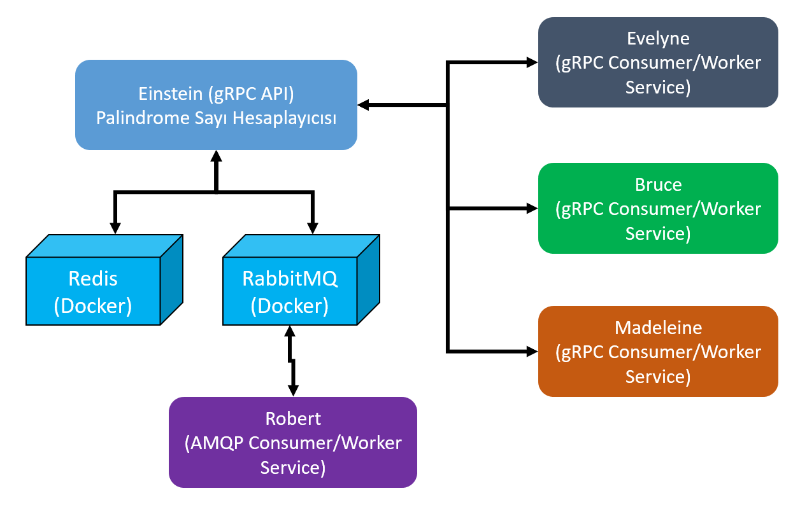

- Einstein, gRPC tabanlı bir servis sağlayıcı. İçinde Palindrom sayıları hesap eden bir fonksiyon desteği sunuyor. Servis cache stratejisi için Redis'i kullanacak. 
Cache'te ne mi tutacağız? Daha önceden Palindrome olarak işaretleniş bir sayı varsa bunu kendi adıyla Cache'e alacağız ve 1 saat boyunca orada tutacağız. Aynı sayı tekrar istenirse hesaplanmadan doğrudan cache'den gelecek. Sırf Redis'i senaryoya katalım diye...
Ayrıca bir mesaj kuyruğu sistemini de destekleyecek ki bu noktada RabbitMQ'dan yararlanacağız.

- Evelyne, Bruce ve Madeleine Worker tipinden istemci servisler. _(Onları, başladıktan sonra sürekli talep gönderen servisler olarak düşünelim)_ Belli bir sayıdan başlayarak Eintesein'a talep gönderiyorlar ve gönderikleri sayının Palindrom olup olmadığı bilgisini alıyorlar.

- Robert ise RabbitMQ kuyruğunu dinleyen diğer bir Worker servisimiz.

Amacımız bu senaryoyu Tye destekli olarak inşa edip kolay bir şekilde Kubernetes'e alabilmek. Daha ilkel bir sürüm için [StarCups isimli örneğe](https://github.com/buraksenyurt/tye_sample) de bakabilirsiniz.

_Platform : Windows 10(Sistemde .Net 5, Docker Desktop, kubectl, wsl2 ve tye mevcut)_

## Proje İskeletinin Oluşturulması

Bunun için aşağıdaki adımları icra edelim.

```bash
mkdir SchoolOfMath
cd SchoolOfMath

dotnet new sln

# Einstein isimli gRPC servisinin geliştirilmesi
dotnet new grpc -n Einstein
dotnet sln add Einstein

# Protos klasöründeki greet.proto değiştirilir
# Akabinde servis sınıfı da

# İlk İstemci tarafı oluşturulur
dotnet new worker -n Evelyne
dotnet sln add Evelyne
# Evelyne'nin gRPC servisini kullanabilmesi için gerekli Nuget paketleri eklenir.
cd Evelyne
dotnet add package Grpc.Net.Client
dotnet add package Grpc.Net.ClientFactory
dotnet add package Google.Protobuf
dotnet add package Grpc.Tools
# Ayrıca Tye konfigurasyonu için gerekli extension paketi de yüklenir
dotnet add package --prerelease Microsoft.Tye.Extensions.Configuration
cd ..

# Visual Studio 2019 kullanıyorsak Add new gRPC Service Reference(Connected Services kısmından) ile Einstein'daki proto dosyasının fiziki adresi gösterilerek gerekli proxy tipinin üretilmesi kolayca sağlanabilir.

# İkinci Worker servisi ekliyoruz (Bruce)
# Tek fark 1den değil de 10000den başlamasıdır (Burada da Add new gRPC servis yapmayı unutmayalım)
dotnet new worker -n Bruce
dotnet sln add Bruce
cd Bruce
dotnet add package Grpc.Net.Client
dotnet add package Grpc.Net.ClientFactory
dotnet add package Google.Protobuf
dotnet add package Grpc.Tools
dotnet add package --prerelease Microsoft.Tye.Extensions.Configuration
cd ..

# Üçüncü Worker servis Madeleine de benzer şekilde eklenir
dotnet new worker -n Madeleine
dotnet sln add Madeleine
cd Madeleine
dotnet add package Grpc.Net.Client
dotnet add package Grpc.Net.ClientFactory
dotnet add package Google.Protobuf
dotnet add package Grpc.Tools
dotnet add package --prerelease Microsoft.Tye.Extensions.Configuration
cd ..

# Yukradaki işlemler tamamlandıktan sonra en azından aşağıdaki terminal komutu ile 
# servisleri ayağa kaldırıp loglara bakmakta yarar var
tye run
```

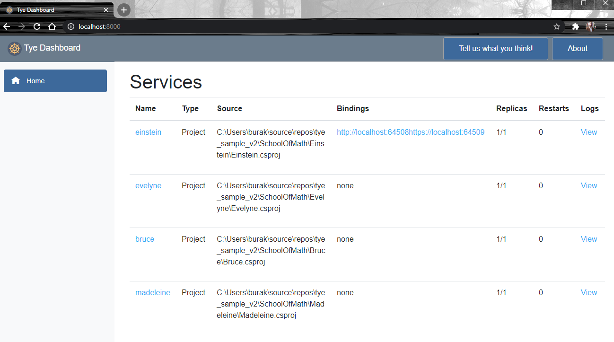

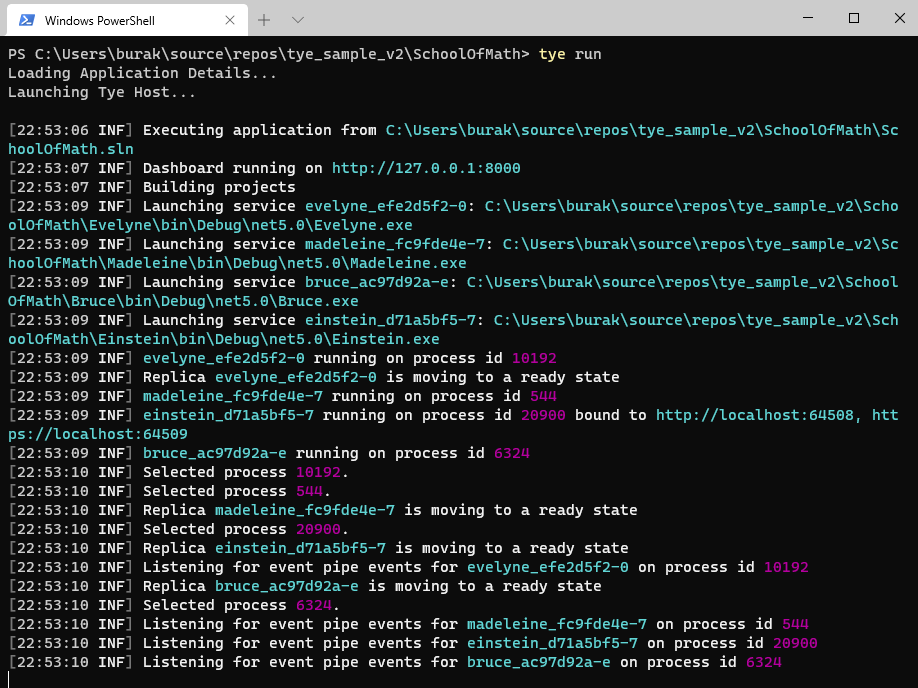

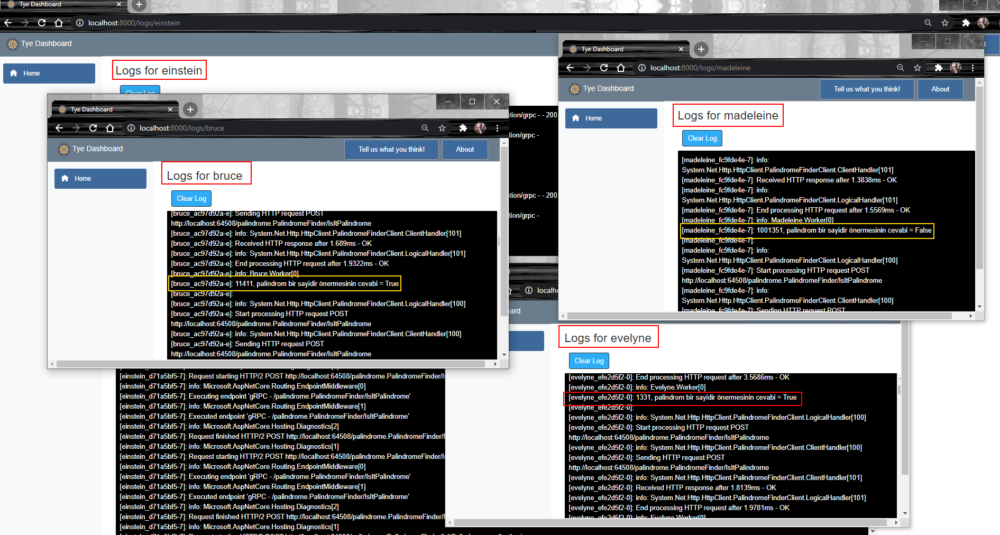

## Redis Desteğinin Eklenmesi

Hem redis hem rabbitmq hizmetlerinin ilave edilmesi hem de kubernetes geçiş hazırlıkları için tye.yaml dosyasını oluşturmalıyız.

```bash
tye init

# tye.yaml dosyasın redis için gerekli ekleri yaptıktan sonra
# einstein (gRPC API servisimiz) cache desteği için gerekli nuget paketleri eklenir
cd einstein
dotnet add package Microsoft.Extensions.Configuration
dotnet add package Microsoft.Extensions.Caching.StackExchangeRedis
cd ..
```

Şu noktada tye run ile çalıştırdığımızda en azından aşığıdaki gibi Redis kullanıldığını görmek lazım.


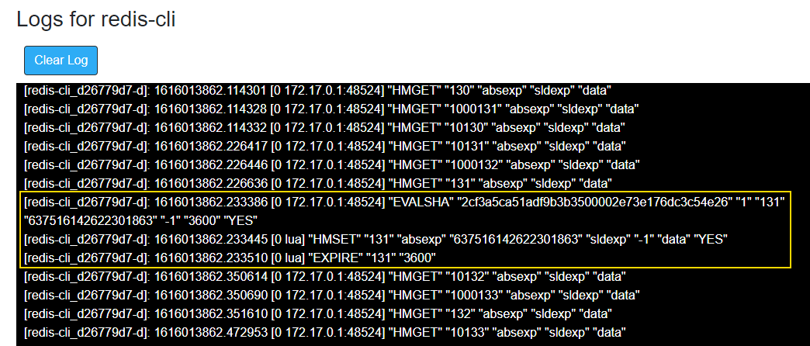

## RabbitMQ Hizmetinin Eklenmesi

Palindrome sayılar buldukça bunları RabbitMQ'ya mesaj olarak yollayacak bir düzenek ekleyeceğiz. RabbitMQ'da, Redis gibi çalışma zamanında ayakta olması beklenen bir servis. Bu nedenle tye.yaml dosyasında gerekli eklemeler yapılmalı.

Sonrasında Einstein isimli servis uygulamasına rabbitmq paketini ekliyoruz.

```bash
cd Einstein
dotnet add package RabbitMQ.Client
cd ..
```

Kod tarafında RabbitMQ kullanımı için gerekli tipler, GoldenHammer isimli sınıfta yer alıyor. [Kaynak](https://github.com/PacktPublishing/Adopting-.NET-5--Architecture-Migration-Best-Practices-and-New-Features/tree/master/Chapter04/microservicesapp) 
_(God Object tadındaki bir sınıf ama senaryoda kullanmak basit olduğundan işime geldi. Daha iyi bir şekilde düzenlemek lazım)_

Bu noktada yine tye run diye ilerleyip http://localhost:15672 adresine ulaşarak RabbitMQ tarafının işler olduğunu görmekte yarar var.

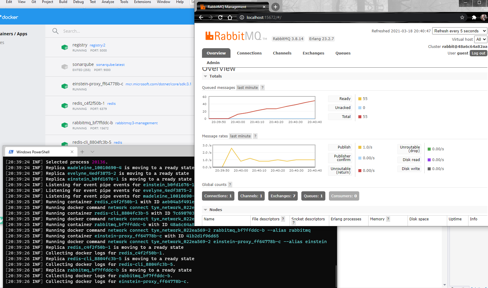

## AMQP İstemcisinin Eklenmesi (Robert)

Robert isimli Worker tipinden olan son istemci uygulama, RabbitMQ'ya atılan palindrome sayıları içeren mesajları yakalamakla görevli. RabbitMQ dinleyicisi olduğunu söyleyebiliriz. Einstein isimli servis Palindrome sayısı hesapladıkça RabbitMQ'ya bunu mesaj olarak yolluyordu. Consumer'dan bunları yakalamayı bekliyoruz.

```bash
dotnet new worker -n Robert
dotnet sln add Robert
cd Robert
# RabbitMQ istemcisi olacağı için eklenecek paket
dotnet add package RabbitMQ.Client
# ve pek tabii Tye özelliklerini kullanabilmesi için de gerekli konfigurasyon paketi
dotnet add package --prerelease Microsoft.Tye.Extensions.Configuration
```

Robert kodları tamamlandıktan sonra _tye run_ ile sistemi çalıştırıp dashboard üzerinden ulaşabileceğimiz logları kontrol etmekte yarar var. Bakalım Robert loglarında RabbitMQ daki _palindromes_ isimli kuyruğa düşüen mesajlar var mı?

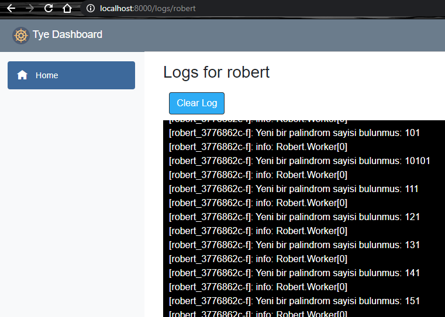

### Sadece Belli Uygulamaları Çalıştırmak

tye.yaml dosyasında tag bildirimlerini kullanarak _tye run_ sonrası sadece belli servislerin ayağa kaldırılması sağlanabilir. Debug işlemleri için idealdir. N tane servisin olduğu senaryolarda her şeyi ayağa kaldırmak yerine gerekenleri kurcalama noktasında çok faydalıdır.

```bash
tye run --tags middleware #sadece middleware tag'ine sahip servisleri çalıştırır.
```

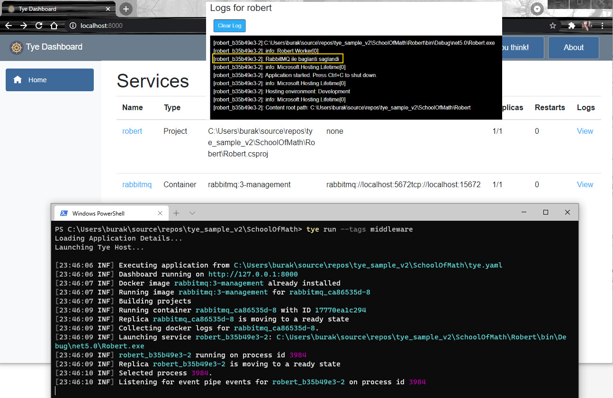

```bash
# Mesela aşağıdaki kullanım ile backend ve middleware tag'ine sahip servisler ayağa kaldırılır
tye run --tags backend middleware
```

## Debug Etmek ve Breakpoint Noktalarına Geçmek

tye ile çalışırken ayağa kaldırılan uygulamaları debug etmek için _şimdilik_ biraz daha meşakkatli bir yol izlemek gerekiyor.

İlk olarak gerekli yerlere breakpoint konulur. Örneğin;

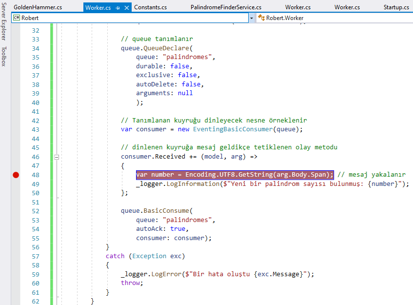

```bash
# Aşağıdaki komut ile sistem çalıştırlır
tye run --debug
```

Terminalde loglarına düşen process id bulunur.

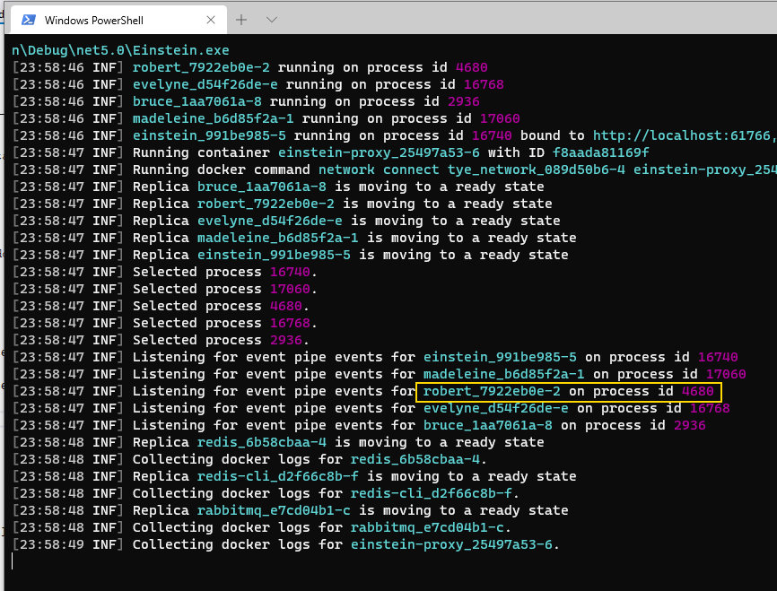

__Visual Studio -> Debug -> Attach to Process__ adımları kullanılarak ilgili process çalışma zamanına alınır.

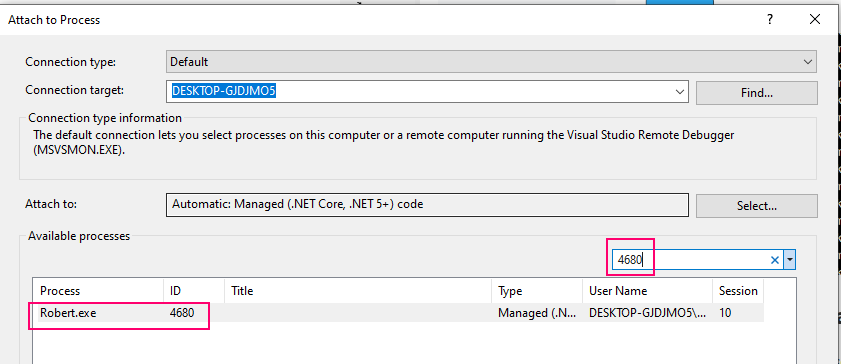

__Breakpoint__ noktasına gelinmesi beklenir.

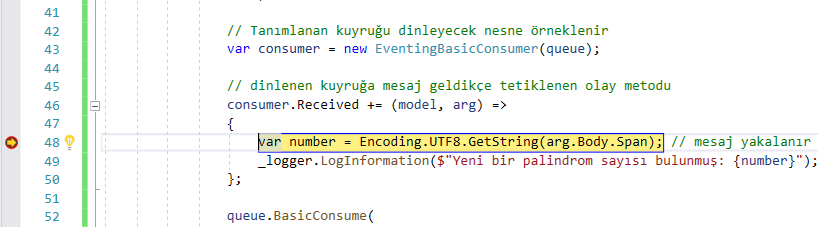

## Kubernetes Deploy İşlemleri

Windows 10 üstündeki Docker Desktop'ın K8s Enabled özelliği açık. Buna göre sistemde tye.yaml tarafındaki servislerin alınabileceği bir K8s Cluster mevcut.
İkinci olarak bir container registry'ye ihtiyaç var.

```bash
# container registry için aşağıdaki komut kullanılabilir.
docker run -d -p 5000:5000 --restart=always --name registry registry:2

# Örnek iki harici servis kullanmakta
# Redis ve RabbitMQ. Bunları şu an için K8s ortamına elle deploy etmeliyiz.
# Bunun için redis.yaml ve rabbitmq.yaml tanım dosyalarını hazırlayıp,
# aşağıdaki terminal komutları ile K8s'e deploy ediyoruz.

kubectl apply -f .\rabbitmq.yaml
kubectl apply -f .\redis.yaml
```

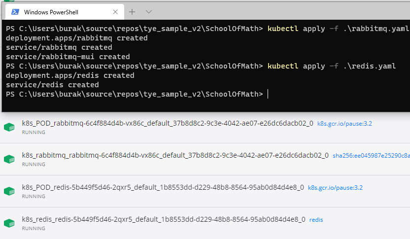

```bash
# K8s'e uygulamaları deploy etmek için
tye deploy --interactive

# redis için adres sorduğunda       ->  redis:6379
# rabbitmq için adres sorduğunda    ->  rabbitmq:5672 (Mui sebebiyle iki kez sorabilir)
```

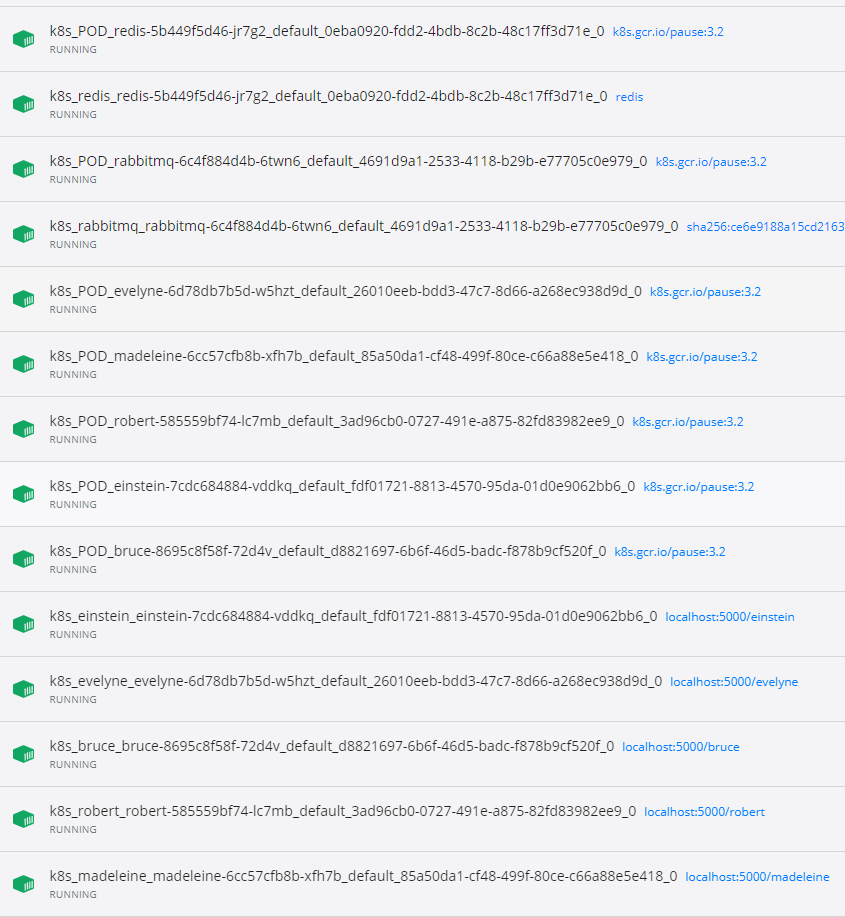

Eğer localhost:30072 adresine gidilirse RabbitMQ tarafındaki hareketlilik de izlenebilir.

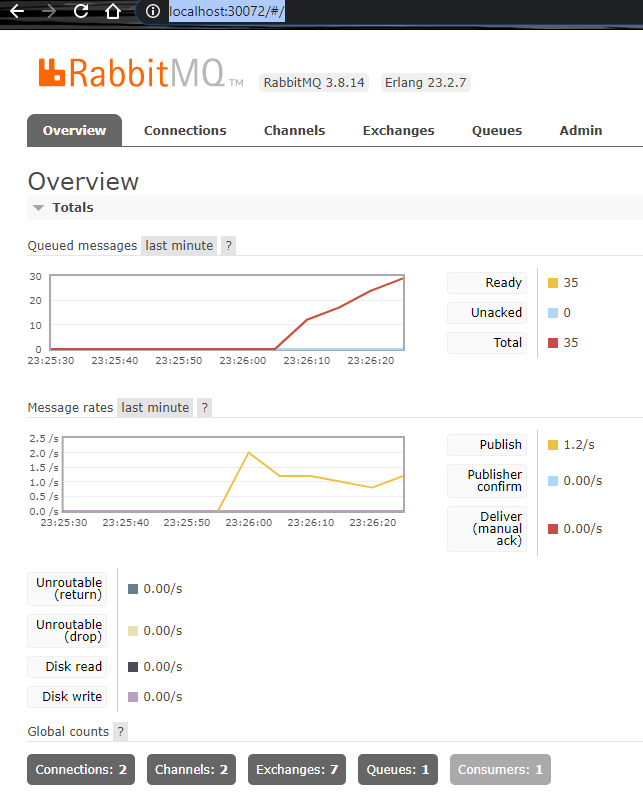

Yapılan Deployment işlemini geri almak ve K8s dağıtımlarını kaldırmak içi aşağıdaki terminal komutu kullanılır.

```bash
tye undeploy
```